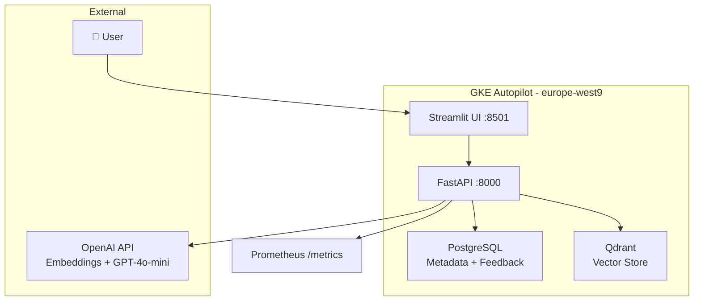

# 📄  DocSense

Multi-tenant document Q&A platform powered by RAG

DocSense lets companies or any organisations upload internal documents and ask questions about them - it works with AI and answers have low latency too.
Organisations's documents are isolated from each other so someone from another organisation will only be able to ask about his own organisation documents.

**Built for:** Portfolio demonstration of prodcution ML engineering practices.

[](https://github.com/Ryqn0/docsense/actions)


---

## 🚀 Live Demo

| Service | URL |
|---|---|
| Streamlit UI | http://34.155.95.181:8501 |
| API (Swagger) | http://34.155.83.37:8000/docs |

(They are closed for costs reasons)

---

## 🏗️ Architecture



---

## ✨ Features

- **Document ingestion** — upload PDF or TXT, chunks at 512 tokens and 64 of overlap
- **Semantic search** — vector similarity via Qdrant
- **Cited answers** — GPT-4o-mini answers grounded in retrieved chunks, never hallucinates (prompt)
- **Multi-tenancy** — complete data isolation per organisation via `tenant_id` filtering
- **Feedback loop** — thumbs up/down ratings will help re-ranking answers
- **Evaluation** — faithfulness, answer similarity, context precision via LLM-as-judge
- **Observability** — structured JSON logs (structlog), Prometheus metrics, request middleware
- **CI/CD** — GitHub Actions: ruff lint + pytest + Docker build on every push

---

## 🛠️ Tech Stack

| Layer | Technology |
|---|---|
| API | FastAPI + uvicorn |
| Frontend | Streamlit |
| Database | PostgreSQL 16 + SQLAlchemy + Alembic |
| Vector store | Qdrant |
| Embeddings | OpenAI text-embedding-3-small |
| LLM | GPT-4o-mini |
| Tokenizer | tiktoken (cl100k_base) |
| Observability | structlog + prometheus-client |
| Container | Docker + Docker Compose |
| Orchestration | Kubernetes (GKE Autopilot) |
| Registry | GCP Artifact Registry |
| CI/CD | GitHub Actions |
| Language | Python 3.12 + uv |

---

## ⚡ Quickstart (Local)

**Prerequisites:** Docker Desktop, WSL2 (Windows), Python 3.12

```bash
git clone git@github.com:Ryqn0/docsense.git
cd docsense

# Copy and fill in your credentials
cp .env.example .env   # add OPENAI_API_KEY

# Start all services
docker compose up --build

# Run database migrations
docker exec -it docsense-api-1 uv run alembic upgrade head
```

Open:
- `http://localhost:8501` — Streamlit UI
- `http://localhost:8000/docs` — API documentation

---

## 📁 Project Structure

docsense/
├── services/
│   ├── api/          # FastAPI backend
│   └── frontend/     # Streamlit UI
├── ml/
│   ├── embeddings/   # OpenAI embedding client
│   ├── retrieval/    # Chunker, vector store, re-ranker, generator
│   └── evaluation/   # Metrics + evaluator
├── infrastructure/
│   ├── docker/       # Dockerfiles
│   └── k8s/          # Kubernetes manifests (GKE)
├── tests/            # pytest unit tests
├── data/eval_sets/   # Golden evaluation set
└── .github/workflows # CI pipeline

---

## 🔄 RAG Pipeline

**Upload**: PDF/TXT → tiktoken chunks → OpenAI embeddings → Qdrant
**Query**:  question → embed → Qdrant search → re-rank (feedback) → GPT-4o-mini → cited answer
**Eval**:   golden set → faithfulness + answer similarity + context precision

---

## 📊 Evaluation Metrics

| Metric | Method | Our Score |
|---|---|---|
| Faithfulness | LLM-as-judge (GPT-4o-mini) | 1.0 |
| Answer Similarity | Cosine similarity of embeddings | 0.914 |
| Context Precision | Batched LLM relevance check | 0.5* |

*Context precision reflects limited test data (2 documents). Score improves with diverse document sets.

---

## 🏛️ Phases Built

| Phase | What | Key concepts |
|---|---|---|
| 0 | Foundations | Git, uv, pre-commit, WSL2 |
| 1 | Local skeleton | Docker Compose, FastAPI, Streamlit |
| 2 | Data pipeline | SQLAlchemy, Alembic, chunking |
| 3 | RAG core | Embeddings, Qdrant, LLM generation |
| 4 | Evaluation | RAGAS-style metrics, LLM-as-judge |
| 5 | Feedback loop | Re-ranking, session state |
| 6 | Observability | structlog, Prometheus, middleware |
| 7 | CI/CD | GitHub Actions, pytest |
| 8 | Local K8s | kind, manifests, kubectl |
| 9 | GCP deployment | GKE Autopilot, Artifact Registry |
| 10 | Hardening | Rate limiting, load testing |

---

## 📊 Performance Baselines

| Endpoint | Latency (p50) | Notes |
|---|---|---|
| `GET /health` | 5ms | No dependencies |
| `GET /feedback/stats` | 9ms | Single DB query |
| `POST /documents/upload` | 458ms | File write + chunk + embed |
| `POST /search/` | 970ms | Embed + Qdrant + GPT-4o-mini |

Load tested: 10 concurrent users, 30s, 4.83 req/s throughput.
Rate limiting: 10 search/min per IP, 5 uploads/min per IP.
